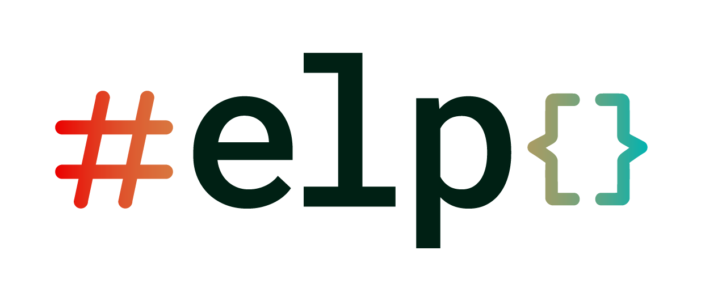

# Erlang Language Platform (ELP)



## Description

ELP integrates Erlang into modern IDEs via the language server protocol.

ELP was inspired by [rust-analyzer](https://github.com/rust-lang/rust-analyzer).

## Terms of Use

You are free to copy, modify, and distribute ELP with attribution under the
terms of the Apache-2.0 and MIT licences.  See [LICENCE-APACHE](./LICENCE-APACHE) and
[LICENCE-MIT](./LICENSE-MIT) for details.

## Prerequisites

### VS Code
1. [Install VS Code](https://www.internalfb.com/intern/wiki/Vscode/Getting_Started/First_Run_Launch_Login_VS_Code/#installation)
1. Install [Erlang LS @ Meta] (not yet published on app store)

### Emacs
1. Download the appropriate elp executable from https://github.com/WhatsApp/erlang-language-platform/releases, and make sure it is on your `$PATH`.
1. Add the following to your emacs init file

```elisp
(use-package lsp-mode
  :custom
  (lsp-semantic-tokens-enable t)

  :config
  ;; Enable LSP automatically for Erlang files
  (add-hook 'erlang-mode-hook #'lsp)

  ;; ELP, added as priority 0 (> -1) so takes priority over the built-in one
  (lsp-register-client
   (make-lsp-client :new-connection (lsp-stdio-connection '("elp" "server"))
                    :major-modes '(erlang-mode)
                    :priority 0
                    :server-id 'erlang-language-platform))
  )
```

## How to use ELP

### Using it with rebar3 projects

1. Use OTP 25
2. Download the `elp` binary for your system from https://github.com/WhatsApp/erlang-language-platform/releases

    > On Mac you will probably get the following message when trying to run the executable the first time: "elp cannot be opened because the developer cannot be verified.".
    To solve this, go to Preferences > Security and Privacy and add an exception. Alternatively, you can build elp from source.

3. Add `eqwalizer_support` dependency and `eqwalizer_rebar3` plugin
   to your rebar3 project definition (see below)
4. From the project directory run:
  - `elp eqwalize <module>` to type-check a single module
  - `elp eqwalize-all` to type-check all `src` modules in the project


Adding `eqwalizer_support` and `eqwalizer_rebar3`:

```
{deps, [
  {eqwalizer_support,
    {git_subdir,
        "https://github.com/whatsapp/eqwalizer.git",
        {branch, "main"},
        "eqwalizer_support"}}
]}.

{project_plugins, [
  {eqwalizer_rebar3,
    {git_subdir,
        "https://github.com/whatsapp/eqwalizer.git",
        {branch, "main"},
        "eqwalizer_rebar3"}}
]}.
```

## References

* [rust-analyzer](https://github.com/rust-lang/rust-analyzer)

## Contributing

* [CONTRIBUTING.md]: Provides an overview of how to contribute changes to ELP (e.g., diffs, testing, etc)

## License

erlang-language-platform is dual-licensed
* [Apache](./LICENSE-APACHE).
* [MIT](./LICENSE-MIT).
