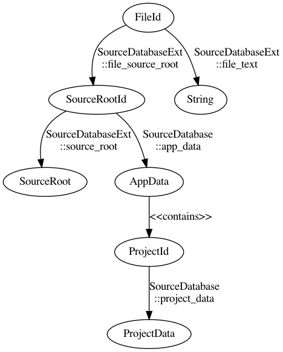
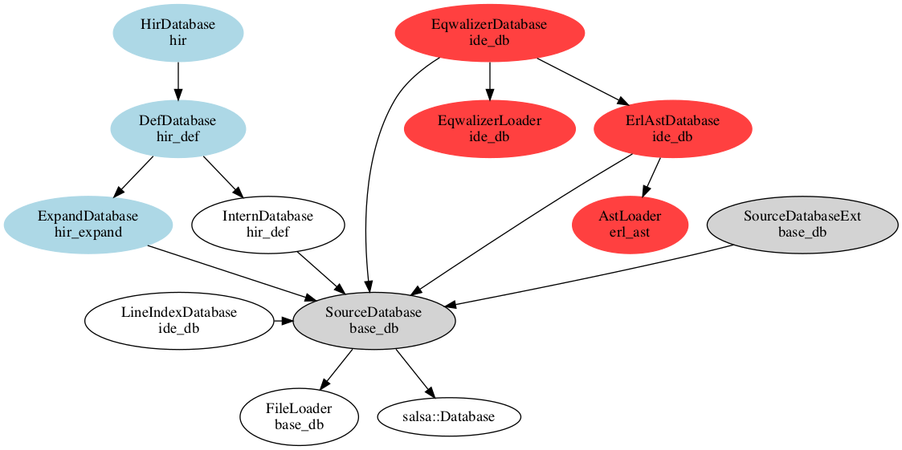
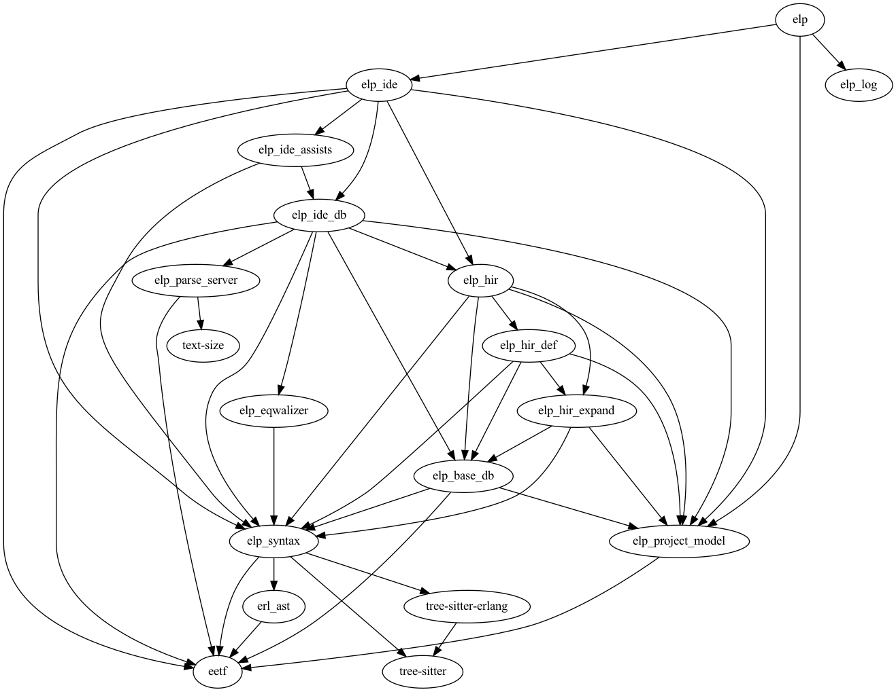

# Erlang Language Platform Architecture

TL;DR: The API to use to programme against ELP is
[Semantics](#semantics) and the high level IR is stored in an
[ItemTree](#itemtree).

This document describes the architecture of ELP at the point where the
diff stack at D32881714 lands.

See [below](#crates) for an overview of the crates in the system and
their invariants.

See also the [rust analyzer
guide](https://github.com/rust-lang/rust-analyzer/blob/master/docs/dev/guide.md)
for some background, most of which is applicable to ELP.

## Data Flow

ELP is built on [salsa](https://salsa-rs.github.io/salsa/) which is a
Rust framework for writing incremental, on-demand programs.

The salsa engine is provided with inputs, which can be updated from
time to time, and then queries can be made on it to generate new
artifacts.

Every time a query is called, the salsa internal state is checked to
see if any of its (transitive) dependencies has changed, and if not
the cached value is returned.

Queries are normal rust code, implementing a specific trait tagged
with salsa attributes.

### Inputs

The diagram below maps salsa queries in ELP to the artifacts they
produce. Each transition is labeled with the relevant [salsa
database](#salsa-databases) and the query on it.



The key input is `file_text`, which maps a `FileId` to its source text.

In the LSP case the ELP LSP server keeps the set of files and their text
up to date as the user changes files in their IDE, or the files change
on the file system.

In the CLI case these are either preloaded or loaded as needed into
salsa.

### Salsa Databases

There is only one pool of salsa data, but in salsa terminology a
database is a grouping of related functionality exposed as a rust
trait, something like a Java interface.  And a given database can
include others, in an inheritance relationship.

The overall structure of this relationship is shown below



The ones providing input are shaded grey, and each is marked with its
originating crate.

The file source is set in `SourceDatabaseExt`, which is broken out of
the hierarchy to enable lightweight test fixture construction.

The `SourceDatabase` includes setting up the project model.

At the moment (2021-12), the `EqwalizerDatabase` works with the
project model and legacy parser.  All the databases related to the
legacy parser have a red background.

The `HirDatabase` provides the main API entry point for tools and
internal features to use the ELP frontend processing. HIR stands for
High level Internal Representation. The HIR databases have a light
blue background.

The HIR database is morally divided into internal private sub_crates,
called `hir_xxx` for some `xxx`, which should only ever be accessed
via a fellow `hir_xxx`.

### Data Pump

Since Salsa provides a pull based architecture, something must do the
pulling to trigger any computation.

For the CLI usage this is part of the command invoked, after the
project has been loaded, so it will not be discussed further here.

In the LSP server, when a notification is received from the client
that a file has changed, this change is pushed into the [Virtual File
System (VFS)](#virtual-file-system-vfs) (which is outside of salsa)
and the fact that the file has changed is recorded in the VFS.

The main loop then processes this list of changes, calling the salse
input function `set_file_text` per changed `FileId`, and also updating
the `LineIndexDatabase` for the given file.

Once the salsa inputs are updated, a data pull is initiated by calling
for updated diagnostics, via an [Analysis](#analysis-and-analysishost)
snapshot.

This represents a state of the salsa database at the time the
diagnostics are requested, and any operations on it will be cancelled
as soon as a new operation is invoked on an `Analysis` snapshot.

The `ide::diagnostics::diagnostics()` function kicks off the process,
by parsing to the rowan tree AST.

```rust
parse(&self, file_id: FileId) -> Parse<SourceFile>;
```

Because the parse function is on `SourceDatabase`, the result will
automatically be stored in the salsa database against the `FileId`
key.  Internally the parse function asks for the `file_text`, via
another salsa query, and salsa automatically tracks this dependency
for managing the validity of the cache.

This process continues, requesting whatever level of analysis is
required from the code base until the required diagnostics are
generated.

Any other part of ELP needing similar analysis, e.g. constructing
hover info, processing assists, will reuse the results cached from the
diagnostics calculation.

## Analyis Layers

The Erlang source text is converted through a series of
transformations into representations that are more abstract, but more
useful for analyis.

All of these are computed as needed, and all aim to reference data in
the lower layers, rather than constructing new data.

### Rowan Tree AST

This is the lowest layer, and is generated from the
[tree-sitter](https://tree-sitter.github.io) parse output.

It lives in the `elp_syntax` crate.

The code for this layer is auto-generated from the artifacts produced
from the tree-sitter grammar for Erlang.

It comprises a series of [rowan tree](https://crates.io/crates/rowan)
`SyntaxNode`s capturing the totality of the the input source,
including all whitespace and comments.

These have a layer of `AstNode`s on top providing the as-parsed
structure in a `Parse<SourceFile>`.

While having high fidelity to the original source, this representation
is clumsy to work with and does not have any higher level analyis
attached to it.

For example, no names are resolved, no macros expanded, etc.

### Hir Def

The HIR representation aims to offer a meaningful high-level
representation of source code, while maintaining full incrementality,
and to do this in an efficient, fast way, so it does not lead to lags
in the IDE.  A tall order.

The key data structure for this is an [`ItemTree`](#itemtree), which
captures a high-level view of each source file or macro expansion.

#### ItemTree

This is the primary IR used throughout `hir_def`.  It is the input to
the name resolution algorithm, as well as for API usage.

`ItemTree`s are indexed in the salsa database by
[`HirFileId`](#hirfileid). They are built from the syntax tree of the
parsed file or macro expansion. This means that they are
module-independent: they don't know which conditional compilation
flags are active or which module they belong to, since those concepts
don't exist at this level.

One important purpose of this layer is to provide an "invalidation
barrier" for incremental computations: when typing inside an item
body, the `ItemTree` of the modified file is typically unaffected,
so we don't have to recompute name resolution results or item data

The `ItemTree` for the currently open file can be displayed by using
the VS Code command "Erlang: Debug ItemTree". (coming soon:
T107829182)

The representation of items in the `ItemTree` should generally mirror
the surface syntax: it is usually a bad idea to desugar a syntax-level
construct to something that is structurally different here. Name
resolution needs to be able to process conditional compilation and
expand macros, and having a 1-to-1 mapping between syntax and the
`ItemTree` avoids introducing subtle bugs.

In general, any item in the `ItemTree` stores its [`AstId`](#astid), which
allows mapping it back to its surface syntax.

##### ItemTree Construction

An `ItemTree` is returned by the salsa `DefDatabase::file_item_tree`, which
invokes `ItemTree::file_item_tree_query`.

This calls `DefDatabase::parse_or_expand` to get the top level
`SyntaxNode` of the file or macro expansion.

It then uses the `match_ast!` rust macro to try candidate `SyntaxNode`
casts for the top node, and operate on the one that succeeds.  The
candidates are the results of parsing a file (`ast::SourceFile`), or
the results of expanding a macro, which is one of the [`Fragmentkind`](#fragmentkind)
types.

Each kind of `SyntaxNode` is lowered to the `ItemTree` using its own
specific process.

At the moment this is only for the `ast::SourceFile`

The lowering is done using a `hir_def::item_tree::lower::Ctx`, which
contains the `ItemTree` being built, and an `AstIdMap` which is
constructed for the [`HirFileId`](#hirfileid) being processed.

For the `ast::SourceFile`, it iterates over the `ast::Form`s in the
file, and calls the appropriate lowering function on each, to produce
a `ModItem` for the `ItemTree`.

At the moment (2021-12) only a few of these are implemented to provide
enough information for macro expansion. They will be fully fleshed out
as part of adding the new high-level IR AST to ELP.

## Data flow in HIR

### Processing "Erlang: Expand Macro" request

This walkthough follows the happy path.

The LSP client sends a request to ELP with the current cursor
location, which needs to be on an Erlang macro.

The `elp::handlers::handle_expand_macro` handler is given an Analysis
snapshot of the current state of the salsa storage.

For a snapshot, trying to change the inputs will block, and the
processing will be cancelled if any new change is processed by the
language server.

It invokes `elp_ide::expand_macro::expand_macro`

This constructs a new [Semantics](#semantics) object, which is the
primary API into the HIR layer, and asks it to parse the file
containing the cursor position.

This invokes the `syntax` crate parse, but then caches the result
locally.

The `Semantics` cache is a mapping of the syntax layer `SyntaxNode` to
a [HirFileId](#hirfileid).  A `HirFileId` is a handle to either an
original source file, or to the contents of an expanded macro.

The cache allows us to follow the trail back from a syntax node to the
macro expansion or file containing it.

With the parse result, `expand_macro` identifies the specific token at
the cursor position representing the macro call.

The token is a `SyntaxNode`, which allows requesting its
ancestors. These are traversed until the `ast::MacroCallExpr` is
found, identified by a successful cast from the generic syntax
representation.

This expression is passed to `ide::expand_macro::expand_macro_recur`,
which expands the macro, together with any in the resulting expansion.

Note: This is based on the current rust-analyzer process.  For the
envisaged Erlang UI there would be an option to expand one step only,
and show the results. The LSP client user can then inspect it, and
potentially expand individual sub-macros if desired.

The first step is common in both cases, expand the current macro by
calling the `hir::semantics::Semantics::expand` function with the
macro call.

This call first performs a [Semantic Analysis](#semantic-analysis) to
return a `SourceAnalyzer` for the given macro call. This analyzer
includes a resolver which should be able to resolve the name of the
macro to its originating definition, even if it is in another file.

It then calls [SourceAnalyzer::expand](#sourceanalyzer-expand) to expand the macro, returning a
`HirFileId` for this expansion.

At this point the definition for the macro has been resolved, and the
macro has either been expanded eagerly or its `MacroCallLoc` has been
interned, and is accessible via the `HirFileId`.

The expansion is forced by calling [ExpandDatabase::parse_or_expand](expanddatabase-parse_or_expand)
with the `HirFileId`.

This result is also cached, mapping the root of the syntax tree to the
`HirFileId`, so the originating file for any `SyntaxNode` in the tree
can be later looked up when needed.

At this point one step of macro expansion has been done.  The results
of expansion may in turn include macros though, so for this
implementation they are also expanded, by iterating over all child
nodes in the expansion looking for macro calls, and recursively
invoking `expand_macro_recur` on them.

For UI purposes we are likely to provide a single-step option too,
which does not recursivelyexpand the children.

### Semantic Analyis

Semantic analysis is done by calling the
`hir::semantics::SemanticsImpl::analyze` function on a `SyntaxNode`
which returns a [SourceAnalyzer](#sourceanalyzer).

The first thing this does is to retrieve the originating `HirFileId`
which was cached when either the original source was parsed by
semantics, or the originating macro expansion was cached. This lookup
is done on the root node of the given `SyntaxNode`, and returns an
[InFile](#infile) containing the `HirFileId` and the syntax node.

It then looks for the container, using `SourceToDefCtx::find_container`.

This will either be a file or a macro call, captured in a
[ChildContainer](#childcontainer) structure.

A [Resolver](#resolver) is computed for the container, according to
its type.

This involves constructing a [DefMap](#defmap) for the container, and
returning the [Scope](#scopes)s from it.

A [`SourceAnalyzer`](#sourceanalyzer) is returned with the resolver
from the container if found, or an empty one if not.

### source_file_to_def()

This function is in `hir::source_to_def::SourceToDefCtx`.

It is passed an `InFile` with a [HirFileId](#hirfileid) and a
`ast::SourceFile`.

It first retrieves the `FileId` of the original file, if it is a macro
expansion.

It then invokes `file_to_def` which calls the salsa query
[DefDatabase::file_def_map](#defdatabase-file_def_map) on the `FileId`.

### DefDatabase::file_def_map

This is a transparent salsa query, so the result is not cached.

The actual work happens in `DefMap::file_def_map_query` which
constructs and returns a [DefMap](#defmap).

### Source to Def

This is implemented in `hir::semantics::source_to_def`.

 Maps *syntax* of various definitions to their semantic ids.

This is a very interesting module, and, in some sense, can be considered the
heart of the IDE parts of ELP.

This module solves the following problem:

  Given a piece of syntax, find the corresponding semantic definition (def).

This problem is a part of more-or-less every IDE feature implemented. Every
IDE functionality (like goto to definition), conceptually starts with a
specific cursor position in a file. Starting with this text offset, we first
figure out what syntactic construct are we at: is this a pattern, an
expression, a function clause.

Knowing only the syntax gives us relatively little info. For
example, looking at the syntax of the clause we can realise that
it is a part of a `fundecl` block, but we won't be able to tell
what arity the current function has, and whether the clause does
that that correctly. For that, we need to go from
[`ast::FunctionClause`] to [`module::Function`], and that's
exactly what this module does.

As syntax trees are values and don't know their place of origin/identity,
this module also requires [`InFile`] wrappers to understand which specific
real or macro-expanded file the tree comes from.

The actual algorithm to resolve syntax to def is curious in two aspects:

* It is recursive
* It uses the inverse algorithm (what is the syntax for this def?)

Specifically, the algorithm goes like this:

1. Find the syntactic container for the syntax. For example, field's
    container is the struct, and structs container is a module.
2. Recursively get the def corresponding to container.
3. Ask the container def for all child defs. These child defs contain
    the answer and answer's siblings.
4. For each child def, ask for it's source.
5. The child def whose source is the syntax node we've started with
    is the answer.

It's interesting that both Roslyn and Kotlin contain very similar code
shape.

Let's take a look at Roslyn:

  <https://github.com/dotnet/roslyn/blob/36a0c338d6621cc5fe34b79d414074a95a6a489c/src/Compilers/CSharp/Portable/Compilation/SyntaxTreeSemanticModel.cs#L1403-L1429>
  <https://sourceroslyn.io/#Microsoft.CodeAnalysis.CSharp/Compilation/SyntaxTreeSemanticModel.cs,1403>

The `GetDeclaredType` takes `Syntax` as input, and returns `Symbol` as
output. First, it retrieves a `Symbol` for parent `Syntax`:

  <https://sourceroslyn.io/#Microsoft.CodeAnalysis.CSharp/Compilation/SyntaxTreeSemanticModel.cs,1423>

Then, it iterates parent symbol's children, looking for one which has the
same text span as the original node:

  <https://sourceroslyn.io/#Microsoft.CodeAnalysis.CSharp/Compilation/SyntaxTreeSemanticModel.cs,1786>

Now, let's look at Kotlin:

  <https://github.com/JetBrains/kotlin/blob/a288b8b00e4754a1872b164999c6d3f3b8c8994a/idea/idea-frontend-fir/idea-fir-low-level-api/src/org/jetbrains/kotlin/idea/fir/low/level/api/FirModuleResolveStateImpl.kt#L93-L125>

This function starts with a syntax node (`KtExpression` is syntax, like all
`Kt` nodes), and returns a def. It uses
`getNonLocalContainingOrThisDeclaration` to get syntactic container for a
current node. Then, `findSourceNonLocalFirDeclaration` gets `Fir` for this
parent. Finally, `findElementIn` function traverses `Fir` children to find
one with the same source we originally started with.

One question is left though -- where does the recursion stop? This happens
when we get to the file syntax node, which doesn't have a syntactic parent.
In that case, we loop through all the crates that might contain this file
and look for a module whose source is the given file.

Note that the logic in this module is somewhat fundamentally
imprecise -- due to conditional compilation there's no injective
mapping from syntax nodes to defs.

At the moment, we don't really handle this well and return the
first answer that works. Ideally, we should first let the caller
to pick a specific active conditional compilation configuration
for a given position, and then provide an API to resolve all
syntax nodes against this specific crate.

### SourceAnalyzer::expand

This function expands a macro, looking up its definition in the
`Resolver` stored in the `SourceAnalyzer`.

The resolution uses
`hir_def::resolver::Resolver::resolve_path_as_macro`, which first
checks for a built in macro, and otherwise consults the
[DefMap](#defmap) providing module scope for the definition.

The expansion process happens in `hir_def::AsMacroCall::as_call_id`, which
simply calls `hir_def::AsMacroCall::as_call_id_with_errors` with an
empty error destination.  When we need diagnostics, this is invoked
with a real error destination.

The `as_call_id_with_errors` creates an [AstId](#astid) for the
`MacroCallExpr`. This uses the `AstIdMap` for the given `HirFileId`
which is from the salsa database, so it will only be computed once.

It then calls `hir_def::macro_call_as_call_id` with an `AstIdWithPath`
being a combination of the `FileId`, `AstId` and macro name.

This invokes the resolver, looking up the macro name in the `Scope`
computed earlier.

If it is an eagerly expanded macro this is done immediately by calling
[expand_eager_macro](#expand_eager_macro).

Otherwise it is converted to a `MacroCallId` by making a salsa call to
[intern_macro](#intern_macro) with a `MacroCallLoc` capturing the
resolved definition.

The `MacroCallId` is returned as a `MacroFile` variant of a `HirFileId`.

### intern_macro

Macro ids. That's probably the trickiest bit in ELP, and the reason
why we use salsa at all.

We encode macro definitions into ids of macro calls, this what allows
us to be incremental.

```rust
fn intern_macro(&self, macro_call: MacroCallLoc) -> MacroCallId;
```

This uses the special
[salsa::interned](https://salsa-rs.github.io/salsa/rfcs/RFC0002-Intern-Queries.html)
attribute on the salsa database, which means `db.intern_macro(..)`
will allocate a unique id to the thing interned, which can be looked
up via a call to `db.lookup_intern_macro(..)` with the given id.

Calling `intern_macro` with the same info will return the same id.

### expand_eager_macro

We use this for built-in macros, and does a similar process to the
normal macro expansion.

### ExpandDatabase::parse_or_expand

This salsa call converts a `HirFileId` into a SyntaxNode.  It is marked
as `salsa::transparent`, so is not actually stored in the database, it
is not possible to store `SyntaxNode`s, although the underlying rowan
tree nodes can be stored.

For the `FileId` variant it does a normal parse, for the `MacroFile`
variant it calls [ExpandDatabase::parse_macro_expansion_ast](#expanddatabase-parse_macro_expansion_ast) with the
`MacroCallId`.

### ExpandDatabase::parse_macro_expansion_ast

This is also marked as transparent on the salsa db, so does not store
anything, but any non-transparent calls to salsa while processing it
will be cached in salsa.

So the first call to `ExpandDatabase::macro_expand_ast` does cache its
result.

`macro_expand_ast` looks up the interned macro id, and if it was eagerly expanded
returns the expansion directly.

Otherwise it asks for the [AstExpander](#astexpander) for the provided
macro definition, and applies it, returning a set of tokens.

Macros can occur in many places in the Erlang source code,
corresponding to different grammatical types.  We need to parse the
expanded tokens as the same grammatical type, otherwise we will get
spurious syntax errors. We track the originating type in a [FragementKind](#fragmentkind).

`token_tree_to_syntax_node` converts the tokens back to source text,
wraps it in the appropriate surroundings for the needed fragment kind,
and parses it, returning a `SyntaxNode` and a [TokenMap](#tokenmap)
mapping the locations in the `SyntaxNode` back to the original
locations in macro definition and arguments.

These are returned.

### AstExpander

An AstExpander is an enumeration over built-in or user-defined macros.
Each of these as an `expand_ast` call defined. This takes the
`MacroCallId` and optional macro arguments, and returns a tree of
tokens.

The `hir_expand::token_map::MacroDef::expand_ast` function for
user-defined macros operates as follows.

It first retrieves the previously interned `MacroCallLoc` to access
the macro definition. This returns an `AstId`, which gets converted to
an actual definition via [AstId::to_node](#astid-to_node), re-parsing
the originating file if it has changed in the meantime.

This results in the original low-level syntax
`ast::Macro::MacroDefine` instance.

The macro_call is similarly retrieved.

The macro definition arguments are matched up with the macro call
arguments into a substitutions map, from the definition variable name
to the call argument.

The macro expansion then takes place in `MacroDef::substitute`, called
with the substitution map and the definition rhs.

Because we cannot actually edit a rowan tree without affecting
everything else that refers to it, this substitution is constructed by
splicing the tokens from the definition rhs, in a traversal that looks
for macro argument usage, and uses the substitution tokens instead.

So we end up with a tree representing the expansion with substitution.

This is returned.

## Key data structures

### `elp_base_db::input::SourceRoot`

Files are grouped into source roots. A source root is a directory on
the file systems which is watched for changes. Typically it
corresponds to an OTP application. Source roots *might* be nested: in
this case, a file belongs to the nearest enclosing source root. Paths
to files are always relative to a source root, and ELP does not know
the root path of the source root at all. So, a file from one source
root can't refer to a file in another source root by path.

An `elp_base_db::input::SourceRootId` is used to refer to a
`SourceRoot` in a salsa query for it.

### `elp_base_db::input::ProjectData`

Source roots (apps) are grouped into projects that share some of the
configuration.  They are indexed in salsa with
`elp_base_db::input::ProjectId`

Prior to buck2, there is a correspondance between an instance of
`ProjectData` and a rebar config file. **True?**

```rust
pub struct ProjectData {
    pub root_dir: AbsPathBuf,
    pub deps_ebins: Vec<AbsPathBuf>,
    pub ast_dir: AbsPathBuf,
    pub build_info_path: AbsPathBuf,
}
```

### `elp_base_db::input::AppData`

`AppData` captures the information for an app from the rebar
`project_app_dirs` list.  It includes the `ProjectId` of the
`ProjectData` containing this app.

They are indexed in salsa with
`elp_base_db::input::SourceRootId`

```rust
pub struct AppData {
    pub project_id: ProjectId,
    pub dir: AbsPathBuf,
    pub include_path: Vec<AbsPathBuf>,
    pub src_dirs: Vec<String>,
    pub extra_src_dirs: Vec<String>,
    pub macros: Vec<eetf::Term>,
    pub parse_transforms: Vec<eetf::Term>,
}
```

### Analysis and AnalysisHost

#### `elp_ide::Analysis`

`Analysis` is a snapshot of a world state at a moment in time. It is the
main entry point for asking semantic information about the world. When
the world state is advanced using `AnalysisHost::apply_change` method,
all existing `Analysis` are canceled (most method return
`Err(Canceled)`).

```rust
pub struct Analysis {
    db: salsa::Snapshot<RootDatabase>,
}
```

#### `elp_ide::AnalysisHost`

`AnalysisHost` stores the current state of the world.

```rust
pub struct AnalysisHost {
    db: RootDatabase,
}
```

### `elp_ide_db::RootDatabase`

The `RootDatabase` is the physical structure providing storage for all
the non-test salsa databases.

It also provides a means to access the external processes for
`Eqwalizer` and the legacy Erlang parser.

```rust
pub struct RootDatabase {
    storage: salsa::Storage<Self>,
    erlang_services: Arc<RwLock<FxHashMap<ProjectId, Connection>>>,
    eqwalizer: Eqwalizer,
}
```

One of them is created when loading a project via the CLI, and the LSP
server has one too.

### `elp_syntax::Parse<SourceFile>`

This is the output of parsing an Erlang source file.  It is a
structure representing the rowan tree and errors found while parsing
the file.

```rust
pub struct Parse<T> {
    green: GreenNode,
    errors: Arc<Vec<SyntaxError>>,
    _ty: PhantomData<fn() -> T>,
}
```

### Semantics

`hir::semantics::Semantics` provides the primary API to get semantic
information, like types, from syntax trees.

### HirFileId

Input to ELP is a set of files, where each file is identified by
`FileId` and contains source code. However, another source of source
code in Erlang are macros: each macro can be thought of as producing a
"temporary file". To assign an id to such a file, we use the id of the
macro call that produced the file. So, a `HirFileId` is either a
`FileId` (source code written by user), or a `MacroCallId` (source
code produced by macro).

What is a `MacroCallId`? Simplifying, it's a `HirFileId` of a file
containing the call plus the offset of the macro call in the
file. Note that this is a recursive definition! However, the size_of
of `HirFileId` is finite (because everything bottoms out at the real
`FileId`) and small (`MacroCallId` uses the location interning. You
can check details here:
<https://en.wikipedia.org/wiki/String_interning>).

### SourceAnalyzer

`SourceAnalyzer` is a convenience wrapper which exposes HIR API in
terms of original source files. It should not be used inside the HIR
itself.

It contains a `HirFileId` and a [Resolver](#resolver) for it.

### InFile

 `InFile<T>` stores a value of `T` inside a particular file/syntax
 tree.

 Typical usages are:

* `InFile<SyntaxNode>` -- syntax node in a file
* `InFile<ast::FnDef>` -- ast node in a file
* `InFile<TextSize>` -- offset in a file

```rust
pub struct InFile<T> {
    pub file_id: HirFileId,
    pub value: T,
}
```

### ChildContainer

Enum used as an index in a [SourceToDefCtx].  For ELP it currently
captures either a `ModuleId` or a `MacroCallExprId`

### Resolver

A `Resolver` stores [Scope](#scope)s for the relevant item, and
provides operations with these scopes.

### Scope

The `hir_def::resolver::Scope` is an enum.  At the moment it only has
a variant to keep track of all the items and included names in a
module.

When ELP is built out further, it will track scopes within clauses,
blocks etc.

For a module this keeps the module id and a [DefMap](#defmap) for the
module, which in turn tracks detailed [ItemScope](#itemscope)s.

### DefMap

A `DefMap` is computed in `hir_def::nameres`.  This process invokes
include file resolution and macro expansion, to provide the set of
items visible in a module, either directly declared or included.

A `DefMap` contains `ModuleData` which contains
[ItemScope](#itemscope) information, detailing the scopes of all items
in the map.

Computing `DefMap` can be partitioned into several logically
independent "phases". The phases are mutually recursive though,
there's no strict ordering.

#### Collecting RawItems

This happens in the `raw` module, which parses a single source
file into a set of top-level items. Macro calls are represented as
a triple of `(Path, Option<Name>, TokenTree)`.

#### Collecting Modules

This happens in the `collector` module. In this phase, we
recursively walk the module, collect raw items from submodules,
populate module scopes with defined items (so, we assign item ids
in this phase) and record the set of unresolved imports and
macros.

While we walk tree of modules, we also record macro_rules definitions and
expand calls to macro_rules defined macros.

#### Resolving Includes

We maintain a list of currently unresolved includes. On every iteration, we
try to resolve some includes from this list. If the include is resolved, we
record it, by adding an item to current module scope.

#### Resolving Macros

Macros from include files are handled similarly to include
files. There's a list of unexpanded macros. On every iteration, we
try to resolve each macro call and, upon success, we run macro
expansion and "collect module" phase on the result

#### Detail

`DefMap::file_def_map_query` creates an empty `DefMap` for the file,
and and invokes `collector::collect_defs` on it.

This creates a `DefCollector` structure to track the state, and seeds
it with the top level items in the module being collected, in an [ItemTree](#itemtree)

These are returned by the salsa `DefDatabase::file_item_tree`, which
invokes `ItemTree::file_item_tree_query` to [construct the
ItemTree](#itemtree-construction)

### ItemScope

This structure carries the main payload for a [DefMap](#defmap).

It keeps hashmaps of resolved names per entity type, as well as for
currently unresolved items.

At the moment (2021-12) the only entity types populated are the
`unresolved` and `macros` ones, but provision is made for types and
values too.

The key API to this is `ItemScope::get`, which is given a
[Name](#name) and returns a [PerNs](#perns) structure for it. This
allows looking up a name without knowing its type, then then
processing what is found.

### PerNs

The `hir_def::per_ns::PerNs` structure has optional fields for types,
values or macros, corresponding to the valid namespaces.

When a name is resolved, one of these fields will be populated with
the actual id and visibility for it.

This structure also supports name overloading, if a name can resolve
into more than one name space.

### Name

In ELP, `Name` can mean one of a number of things.

At the syntax AST level, there is `ast::Name`, which can either be an
`ast::Atom` or `ast::Var`.

At the HIR level, there is `hir_expand::name::Name`. This is a wrapper
around a string, and is used for both references and declarations.

### MacroCallId

A `hir_expand::MacroCallId` identifies a particular macro invocation.
It uses the [interning](#intern-macro) infrastructure to allow
retrieving the original `MacroCallLoc` from it.

### AstId

`AstId` points to an AST node in any file.

It is stable across reparses, and can be used as salsa key/value.

```rust
pub type AstId<N> = InFile<FileAstId<N>>;
```

It is used as an index into an `AstIdMap`, which is an `Arena` of [SyntaxNodePtr](#syntaxnodeptr).
An `Arena` is just a vector of its contents, accessed by the numeric index.

The `AstIdMap` is constructed by traversing the `SyntaxNode` tree for
a file in top-down breadth-first order, and for each item of interest
adding an entry, where its location in the vector is its index.

The breadth first order means even if a file changes its contents, the
index is more likely to still be valid for higher level items.

### AstId::to_node

This converts an `AstId` back to its original reference, even if it
may have moved.  This is done by asking salsa to parse the file stored
in the `AstId`, and generate an `AstIdMap` from it.  These operations
will be NOPs if the file has not changed in the meantime, or will use
the cached value.  This may be different from the one used when the
`AstId` was stored though.  The structure of the `AstId` allows higher
level syntax nodes to be looked up, even if the underlying file has
changed.

### SyntaxNodePtr

A pointer to a syntax node inside a file. It can be used to remember a
specific node across reparses of the same file.

```rust
pub struct SyntaxNodePtr {
    pub(crate) range: TextRange,
    kind: SyntaxKind,
}
```

### TokenMap

When expanding a macro, the expansion works on tokens extracted from
the original syntax AST of the macro definition and call
arguments. Each token is given a unique `TokenId` during this process.

A `hir_expand::token_map::TokenMap` maps this `TokenId` back to a
*relative* text range.

This map allows tracing a location in a macro expansion back to its
precise origin in the original definition or arguments.

### FragmentKind

A macro call can occur in various locations in the Erlang source code,
and as a consequence can have different types.  Since macro expansion
proceeds by manipulating tokens when replacing arguments in a macro
replacement, these tokens need to be parsed back to a syntax AST.

`hir_expand::syntax_bridge::FragmentKind` is an enumeration tracking
what the original syntax type was, so the appropriate parsing fragment
can be invoked.

The ELP tree-sitter grammar has rules for a top-level pseudo Form that
can be one of these fragments, each wrapped in a text string that is
guaranteed not to be valid Erlang syntax.  This allows us to parse a
fragment of a specific type.

### Crates

This section is based on the [rust analyzer architecture](https://github.com/rust-lang/rust-analyzer/blob/master/docs/dev/architecture.md) doc.

#### syntax

Erlang syntax tree structure and parser.

- [rowan](https://github.com/rust-analyzer/rowan) library is used for constructing syntax trees.
- `ast` provides a type safe API on top of the raw `rowan` tree.
-  the tree-sitter compile output generates a description of the
   grammar, which is used to generate `syntax_kinds` and `ast`
   modules, using `cargo xtask codegen` command.

Note  [`api_walkthrough`](https://www.internalfb.com/code/fbsource/[D32881714-V6]/fbcode/whatsapp/elp/crates/syntax/src/lib.rs?lines=1797)
in particular: it shows off various methods of working with syntax tree.

**Architecture Invariant:** `syntax` crate is completely independent
from the rest of ELP. It knows nothing about salsa or LSP.
This is important because it is possible to make useful tooling using
only the syntax tree.  Without semantic information, you don't need to
be able to _build_ code, which makes the tooling more robust.  See
also https://web.stanford.edu/~mlfbrown/paper.pdf.  You can view the
`syntax` crate as an entry point to rust-analyzer.  `syntax` crate is
an **API Boundary**.

**Architecture Invariant:** syntax tree is a value type.

The tree is fully determined by the contents of its syntax nodes, it
doesn't need global context (like an interner) and doesn't store
semantic info.
Using the tree as a store for semantic info is convenient in
traditional compilers, but doesn't work nicely in the IDE.
Specifically, assists and refactors require transforming syntax trees,
and that becomes awkward if you need to do something with the semantic
info.

**Architecture Invariant:** syntax tree is built for a single file.
This is to enable parallel parsing of all files.

**Architecture Invariant:** Syntax trees are by design incomplete and
do not enforce well-formedness.  If an AST method returns an `Option`,
it *can* be `None` at runtime, even if this is forbidden by the
grammar.

### `crates/base_db`

We use the [salsa](https://github.com/salsa-rs/salsa) crate for
incremental and on-demand computation.

Roughly, you can think of salsa as a key-value store, but it can also
compute derived values using specified functions.

The `base_db` crate provides basic infrastructure for interacting with
salsa.

Crucially, it defines most of the "input" queries: facts supplied by
the client of the analyzer.

Reading the docs of the `base_db::input` module should be useful:
everything else is strictly derived from those inputs.

**Architecture Invariant:** particularities of the build system are *not* the part of the ground state.

In particular, `base_db` knows nothing about rebar or buck.

**Architecture Invariant:** `base_db` doesn't know about file system
and file paths.

Files are represented with opaque `FileId`, there's no operation to
get an `std::path::Path` out of the `FileId`.

### `crates/hir_expand`, `crates/hir_def`

These crates are the *brain* of ELP.
This is the compiler part of the IDE.

`hir_xxx` crates have a strong
[ECS](https://en.wikipedia.org/wiki/Entity_component_system) flavor,
in that they work with raw ids and directly query the database.
There's little abstraction here.  These crates integrate deeply with
salsa and chalk.

Name resolution, macro expansion and type inference all happen here.
These crates also define various intermediate representations of the core.

[ItemTree](#itemtree) condenses a single `SyntaxTree` into a "summary" data
structure, which is stable over modifications to function bodies.

[DefMap](#defmap) contains the module tree of a crate and stores module scopes.

`Body` stores information about expressions.

**Architecture Invariant:** these crates are not, and will never be,
an api boundary.

**Architecture Invariant:** these crates explicitly care about being
incremental.  The core invariant we maintain is "typing inside a
function's body never invalidates global derived data".  i.e., if you
change the body of `foo`, all facts about `bar` should remain intact.

**Architecture Invariant:** hir exists only in context of particular
file instance with specific configuration flags.

### `crates/hir`

The top-level `hir` crate is an **API Boundary**.

If you think about "using ELP as a library", `hir` crate is
most likely the façade you'll be talking to.

It wraps ECS-style internal API into a more OO-flavored API (with an
extra `db` argument for each call).

**Architecture Invariant:** `hir` provides a static, fully resolved
view of the code.

While internal `hir_*` crates _compute_ things, `hir`, from the
outside, looks like an inert data structure.

`hir` also handles the delicate task of going from syntax to the
corresponding `hir`.
Remember that the mapping here is one-to-many.
See `Semantics` type and `source_to_def` module.

Note in particular a curious recursive structure in `source_to_def`.
We first resolve the parent _syntax_ node to the parent _hir_ element.
Then we ask the _hir_ parent what _syntax_ children does it have.
Then we look for our node in the set of children.

This is the heart of many IDE features, like goto definition, which
start with figuring out the hir node at the cursor.

This is some kind of (yet unnamed) uber-IDE pattern, as it is present
in Roslyn and Kotlin as well.

### `crates/ide`

The `ide` crate builds on top of `hir` semantic model to provide
high-level IDE features like completion or goto definition.

It is an **API Boundary**.

If you want to use IDE parts of ELP via LSP, custom flatbuffers-based
protocol or just as a library in your text editor, this is the right
API.

**Architecture Invariant:** `ide` crate's API is build out of POD
types with public fields.

The API uses editor's terminology, it talks about offsets and string
labels rather than in terms of definitions or types.

It is effectively the view in MVC and viewmodel in
[MVVM](https://en.wikipedia.org/wiki/Model%E2%80%93view%E2%80%93viewmodel).

All arguments and return types are conceptually serializable.

In particular, syntax trees and hir types are generally absent from
the API (but are used heavily in the implementation).

Shout outs to LSP developers for popularizing the idea that "UI" is a
good place to draw a boundary at.

`ide` is also the first crate which has the notion of change over time.
[AnalysisHost](#analysishost) is a state to which you can
transactionally `apply_change`.
[Analysis](#analysis) is an immutable snapshot of the state.

Internally, `ide` is split across several crates. `ide_assists`,
`ide_completion` and `ide_ssr` implement large isolated features.

`ide_db` implements common IDE functionality (notably, reference
search is implemented here).

The `ide` contains a public API/façade, as well as implementation for
a plethora of smaller features.

**Architecture Invariant:** `ide` crate strives to provide a _perfect_ API.

There are currently two consumers of `ide`, the LSP server and the CLI client.

### `crates/elp`

This crate defines the `elp` binary, so it is the **entry point**.
It implements the language server, and CLI client.

**Architecture Invariant:** `elp` is the only crate that knows about LSP and JSON serialization.
If you want to expose a data structure `X` from ide to LSP, don't make it serializable.
Instead, create a serializable counterpart in `elp` crate and manually convert between the two.

`GlobalState` is the state of the server.
The `main_loop` defines the server event loop which accepts requests and sends responses.
Requests that modify the state or might block user's typing are handled on the main thread.
All other requests are processed in background.

**Architecture Invariant:** the server is stateless, a-la HTTP.
Sometimes state needs to be preserved between requests.
For example, "what is the `edit` for the fifth completion item of the last completion edit?".
For this, the second request should include enough info to re-create the context from scratch.
This generally means including all the parameters of the original request.

**Architecture Invariant:** `elp` should be partially available even when the build is broken.
Reloading process should not prevent IDE features from working.

#### Crates Alphabetically

base_db
eetf
elp
eqwalizer
erl_ast
hir
hir_def
hir_expand
ide
ide_assists
ide_db
erlang_service
project_model
syntax
tree-sitter-erlang

#### Crates Graph



## Virtual File System (VFS)

[A virtual filesystem for Rust](https://docs.rs/vfs/0.5.1/vfs/)

The virtual file system abstraction generalizes over file systems and
allows using different filesystem implementations (e.g. an in memory
implementation for unit tests)

In ELP we use this to keep an in-memory image of the current files
open in the IDE, which will be different form the one on disk if the
LSP client has edited the file, but not yet saved it.

This gives us the current source of truth for the source files, from
the IDE user perspective.

The VFS file system can be partitioned into different areas, and we
use this to create a partition for every app occuring in every
project. See [Key data structures](#key-data-structures)
