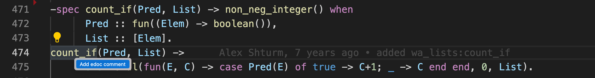
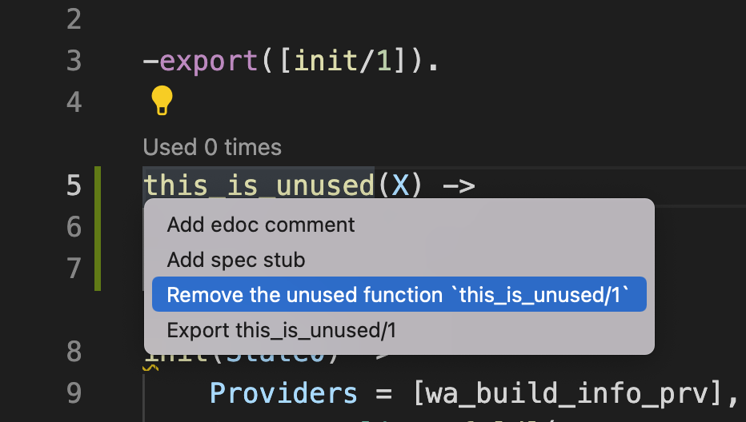

# Code Actions (a.k.a. Assists)

_Code actions_, also known as _assists_, are small local refactorings, often rendered in the text editor using a light bulb icon (💡). They are triggered by either clicking the light bulb icon in the editor or by using a shortcut.

Code actions often provide the user with possible corrective actions right next to an error or warning (known as a _diagnostic_ message using LSP jargon). They can also occur independently of diagnostics.

Here is an example of a _code action_ prompting the user to "Add Edoc comment" for a function which lacks Erlang EDoc documentation.



## The _Code Action_ request

Code actions are requested by the editor using the [textDocument/codeAction](https://microsoft.github.io/language-server-protocol/specifications/lsp/3.17/specification/#textDocument_codeAction) LSP request. Code action requests are handled by the `handlers::handle_code_action` function in the `elp` crate.

## Adding a new code action

### Creating the handler

In this section we will go through the process of adding a new code action from scratch. The code action (aka _assist_) will suggest the user to delete a function, if it is deemed as unused by the Erlang compiler.

Let's start by creating a file called `delete_function.rs` in the `crates/ide_assists/src/handlers` folder, containing a single function declaration:

```
use crate::assist_context::{Assists, AssistContext};

// Assist: delete_function
//
// Delete a function, if deemed as unused by the Erlang compiler.
//
// ```
// -module(life).
//
// heavy_calculations(X) -> X.
// %% ^^^^^^^^^^^^^^^ 💡 L1230: Function heavy_calculations/1 is unused
//
// meaning() ->
//   42.
// ```
// ->
// ```
// -module(life).
// meaning() ->
//   42.
// ```
pub(crate) fn delete_function(acc: &mut Assists, ctx: &AssistContext) -> Option<()> {
    todo!()
}
```

Notice how the function is accompanied by a comment which explains the expected transformation. In the first snippet, we notice that the `heavy_calculations` function is unused and we get a code action for it. In the second snippet we see the outcome of executing the given code action: the unused function is gone. We will go back to the funny syntax used in the snippet in a second.

Before we can start implementing our code action, there's one more thing we need to do: add our new function to the list of _ELP assists_. Open the `crates/ide_assists/src/lib.rs` file and amend the list of handlers:

```
mod handlers {
    [...]
    mod delete_function
    [...]

    pub(crate) fn all() -> &'static [Handler] {
        &[
            [...]
            delete_function:delete_function,
            [...]
        ]
    }
}
```

### Adding a test case

The easiest way to verify our new code action behaves in the expected way is to start with a test case. ELP allows us to write tests in a very intuitive and straightforward way. Do you remember the funny syntax which we introduced in the previous paragraph? We can reuse it to write a testcase!

Add the following to the `delete_function.rs` file:

```
#[cfg(test)]
mod tests {
    use expect_test::expect;

    use super::*;
    use crate::tests::*;

    #[test]
    fn test_delete_unused_function() {
        check_assist(
            delete_function,
            r#"
-module(life).
heavy_calculations(X) -> X.
%% ^^^^^^^^^^^^^^^ 💡 L1230: Function heavy_calculations/1 is unused

meaning() ->
  42.
"#,
            expect![[r#"
-module(life).
meaning() ->
  42.
            "#]],
        )
    }
}
```

The `~` in the snippet represents the cursor position. In our testcase, we are asserting that, given a diagnostic message pointing to the unused function, if the user triggers the respective code action when the cursor is inside the function name, the unused function gets deleted.

If we try running the test, it should fail with a _not yet implemented_ error:

```
$ cargo test --package elp_ide_assists --lib -- handlers::delete_function::tests::test_delete_unused_function --exact --nocapture

[...]
---- handlers::delete_function::tests::test_delete_unused_function stdout ----
thread 'handlers::delete_function::tests::test_delete_unused_function' panicked at 'not yet implemented', crates/ide_assists/src/handlers/delete_function.rs:21:5
[...]
```

### Diagnostic Annotations and Error Codes

Before starting with the actual implementation, let's for a second go back to the syntax we used to specify the _unused function_ diagnostic:

```
%% ^^^^^^^^^^^^^^^ 💡 L1230: Function heavy_calculations/1 is unused
```

This is a test _annotation_ which is used by the ELP testing framework to populate the "context" which is passed to our handler. This is a way to simulate diagnostics coming from external sources (such as the Erlang compiler or a linter), which would be received by the Language Server as part of a `textDocument/codeAction` request.

The annotation has the following format:

```
[\s]%% [^]* 💡 CODE: MESSAGE
```

Essentially, a number of spaces, followed by the `%%` which resembles an Erlang comment, a light bulb, a _code_ identifying the diagnostic type and a string message. The _code_  is an _unofficial error_ code which is emitted by both ELP's _Erlang Service_ (see the `erlang_service:make_code/2` function in `erlang_service/src/erlang_service.erl`) and by the [Erlang LS](https://github.com/erlang-ls/erlang_ls/) language server. The idea is to eventually standardize Erlang error messages and to build what, in the end, should be similar to the [Rust](https://doc.rust-lang.org/error-index.html) or [Haskell](https://errors.haskell.org/) error indexes. In our case, `L1230` is the error corresponding to the `unused_function` diagnostic. The _message_ is a free text string that accompanies the diagnostic.

### Matching on the diagnostic error code

To be able to match the `L1230` error code, we need to add a new variant to the `AssistContextDiagnosticCode` enum. Open the `crates/ide_db/src/assists.rs` file and include the new error code. Don't forget to map it to the `L1230` string.

```
pub enum AssistContextDiagnosticCode {
    UnusedFunction, // <--- Add this
    UnusedVariable,
}

impl FromStr for AssistContextDiagnosticCode {
    type Err = String;
    fn from_str(s: &str) -> Result<Self, Self::Err> {
        match s {
            "L1230" => Ok(AssistContextDiagnosticCode::UnusedFunction), // <--- Add this
            "L1268" => Ok(AssistContextDiagnosticCode::UnusedVariable),
            unknown => Err(format!("Unknown AssistContextDiagnosticCode: '{unknown}'")),
        }
    }
}
```

We are all set. Time to implement the `delete_function` function!

### The implementation

Let's look at our function again.

```
pub(crate) fn delete_function(acc: &mut Assists, ctx: &AssistContext) -> Option<()> {
    todo!()
}
```

We have two input arguments: a mutable _accumulator_ which contains the list of code actions (or _assists_) which we want to return and a _context_, from which we can extract diagnostics.

The following code iterates through the list of diagnostics and, for each diagnostic matching the `UnusedFunction` kind, prints the diagnostic for debugging purposes. We also return `Some(())` to comply with the function signature.

```
use elp_ide_db::assists::AssistContextDiagnosticCode;

[...]
pub(crate) fn delete_function(acc: &mut Assists, ctx: &AssistContext) -> Option<()> {
    for d in ctx.diagnostics {
        if let AssistContextDiagnosticCode::UnusedFunction = d.code {
            dbg!(d);
            todo!()
        }
    }
    Some(())
}
[...]

```

If we run the test, we can see what a diagnostic looks like:

```
$ cargo test --package elp_ide_assists --lib -- handlers::delete_function::tests::test_delete_unused_function --exact --nocapture

[...]
running 1 test
[crates/ide_assists/src/handlers/delete_function.rs:25] d = AssistContextDiagnostic {
    code: UnusedFunction,
    message: "Function heavy_calculations/1 is unused",
    range: 24..40,
}
[...]
```

The diagnostic contains the error code and message, together with its range. What we want to do is:

* Find the function declaration which is pointed by the diagnostic range
* Create a code action to remove the function declaration and add it to the accumulator

How do we find the element which the range covers? Context to the rescue! There's a handy `find_node_at_custom_offset` function we can use. The _offset_ here indicates the number of bytes from the beginning of the file. We can use the beginning of the diagnostic range for our purposes.

```
let function_declaration: ast::FunDecl = ctx.find_node_at_custom_offset::<ast::FunDecl>(d.range.start())?;
let function_range = function_declaration.syntax().text_range();
```

Let's extract the function name/arity and produce a nice message for the user:

```
let function_name = function_declaration.name()?;
let function_arity = function_declaration.arity_value()?;
let message = format!("Remove the unused function `{function_name}/{function_arity}`");
```

With the information we have, we can now create a new code action and add it to the accumulator:

```
let id = AssistId("delete_function", AssistKind::QuickFix);
let function_range = function_declaration.syntax().text_range();
acc.add(id,
    message,
    function_range,
    |builder| {
        builder.edit_file(ctx.frange.file_id);
        builder.delete(function_range)
    },
);
```

The `add` function takes four arguments:

* An internal `AssistId` made of a unique string (the `"delete_function"` string in our case) and a `Kind`. We are specifying `QuickFix` in our case, but have a look to the [LSP specifications](https://microsoft.github.io/language-server-protocol/specifications/lsp/3.17/specification/#codeActionKind) to get a list of the available kinds.
* A message which will be rendered to the user (`"Delete the unused function: [FUNCTION_NAME]"`)
* The range of the function. Notice how the range we got from the diagnostic was covering only the _name_ of the function, but we need to delete the whole function, so we need to pass the full range.
* A function which takes a `builder` as its input and uses it to manipulate the source file. Here we are saying that we want to edit the current file (we extract the `file_id` from the `ctx` context) and that we simply want to delete the range of the function declaration.

Yes. It's as simple as that. For completeness, here is the full function implementation:

```
pub(crate) fn delete_function(acc: &mut Assists, ctx: &AssistContext) -> Option<()> {
    for d in ctx.diagnostics {
        if let AssistContextDiagnosticCode::UnusedFunction = d.code {
            let function_declaration: ast::FunDecl =
                ctx.find_node_at_custom_offset::<ast::FunDecl>(d.range.start())?;
            let function_name = function_declaration.name()?;
            let function_arity = function_declaration.arity_value()?;
            let function_range = function_declaration.syntax().text_range();

            let id = AssistId("delete_function", AssistKind::QuickFix);
            let message = format!("Remove the unused function `{function_name}/{function_arity}`");
            acc.add(id, message, function_range, |builder| {
                builder.edit_file(ctx.frange.file_id);
                builder.delete(function_range)
            });
        }
    }
    Some(())
}
```

You can look at existing assists for more complex manipulation examples.

# Try it yourself

What we wrote is a unit test, but there's nothing better than checking ourselves the behaviour in the IDE.

Compile the `elp` executable:

```
cargo build
```

Then visit the Erlang extension settings page and edit the `elp.path` value to point to the newly built executable, which should reside in:

```
/Users/$USER/fbsource/buck-out/elp/debug/elp
```

Open a VS Code @ Meta (or reload the window if you have one open) and visit an Erlang file from the WASERVER repo. You should see something like:



If that worked, congratulations! You managed to write your first ELP code action!
